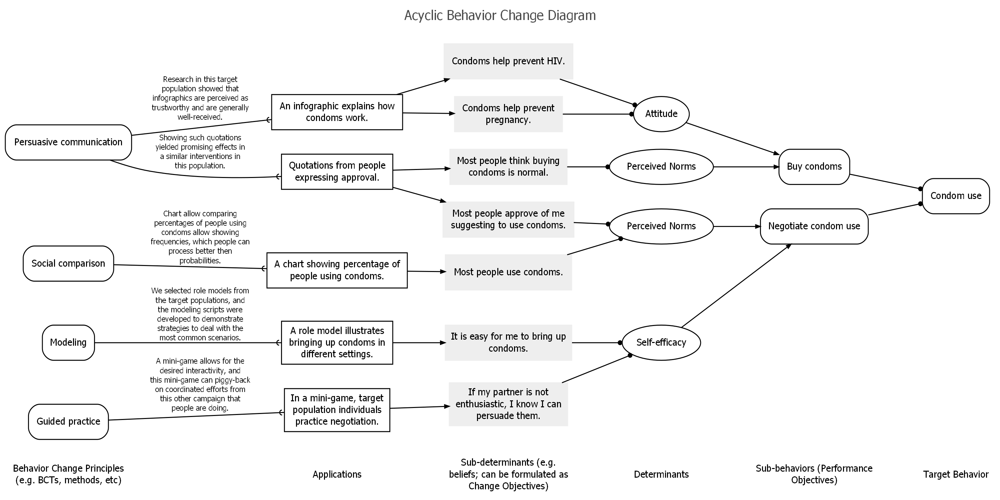
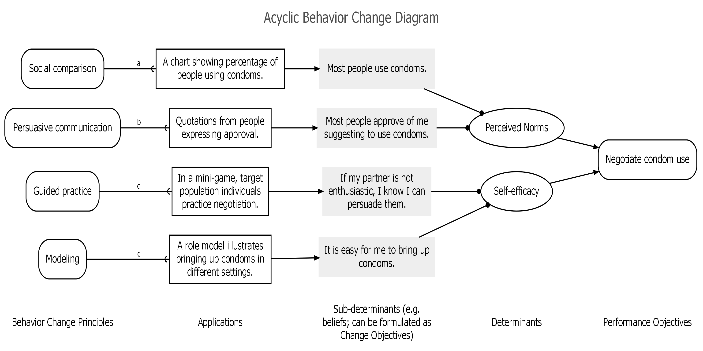

```{r setup, include = FALSE}
knitr::opts_chunk$set(
  collapse = TRUE,
  comment = "#>"
)
```

Acyclic Behavior Change Diagrams (ABCDs) are diagrams that illustrate the logic model (also known as 'theory of change') underlying any intervention, treatment, or campaign aiming to change some aspect of people's minds and/or behaviors. Specifically, the ABCD shows the assumed causal and structural assumptions, thereby showing what is assumed to cause what (e.g. which elements of the intervention are assumed to influence which aspects of the target population's psychology?) and what is assumed to consist of what (e.g. which determinants are assumed to contain which specific aspects of the target population's psychology?).

Such ABCDs are generated from a uniform, machine readable, format: a table, for example as stored in a comma separated values (CSV) file. In it most extensive form, the table has the following columns:

 - **Behavior Change Principles (BCPs)**: The specific
     psychological principles engaged to influence the relevant
     sub-determinants, usually selected using the determinants
     to which the sub-determinants 'belong'. These are also
     known as methods of behavior change in the Intervention
     Mapping framework, or behavior change techniques, BCTs,
     in the Behavior Change Wheel approach. For a list of 99
     BCPs, see Kok et al. (2016).
 - **Conditions for effectiveness**: The conditions
     that need to be met for a Behavior Change Principle (BCP) to
     be effective. These conditions depend on the specific
     underlying Evolutionary Learning Processes (ELPs) that the
     BCP engages (Crutzen & Peters, 2018). If the conditions for
     effectiveness (called *parameters* for effectiveness in the
     Intervention Mapping framework) are not met, the method will
     likely not be effective, or at least, not achieve its
     maximum effectiveness.
 - **Applications**: Since BCP's describe aspects of
     human psychology in general, they are necessarily formulated
     on a generic level. Therefore, using them in an intervention
     requires translating them to the specific target population,
     culture, available means, and context. The result of this
     translation is the application of the BCP. Multiple BCPs can
     be combined into one application; and one BCP can be applied in
     multiple applications (see Kok, 2014).
 - **Sub-determinants**: Behavior change interventions
     engage specific aspects of the human psychology (ideally, they
     specifically, target those aspects found most important in
     predicting the target behavior, as can be established with
     \code{\link[behaviorchange]{CIBER}} plots. These aspects are
     called sub-determinants (the Intervention Mapping framework
     references *Change Objectives*, which are sub-determinants
     formulated according to specific guidelines). In some
     theoretical traditions, sub-determinants are called *beliefs*.
 - **Determinants**: The overarching psychological constructs that
     are defined as clusters of specific aspects of the human
     psychology that explain humans' behavior (and are targeted
     by behavior change interventions). Psychological theories
     contain specific definitions of such determinants, and make
     statements about how they relate to each other and to human
     behavior. There are also theories (and exists empirical
     evidence) on how these determinants can be changed (i.e. BCPs),
     so althought the sub-determinants are what is targeted in an
     intervention, the selection of feasible BCPs requires knowing
     to which determinants those sub-determinants belong.
 - **Performance objectives**: The specific sub-behaviors that often
     underlie (or make up) the ultimate target behavior. These are
     distinguished from the overarching target behavior because
     the relevant determinants of these sub-behaviors can be
     different: for example, the reasons why people do or do not
     *buy* condoms can be very different from the reasons why they
     do or do not *carry* condoms or why they do or do not
     *negotiate* condom use with a sexual partner.
 - **Behavior**: The ultimate target behavior of the intervention,
     usually an umbrella that implicitly contains multiple
     performance objectives.

ABCDs can be generated using the [behaviorchange::abcd()] function in the `behaviorchange` R package.

They can also be generated from the online app that runs at https://a-bc.eu/apps/abcd.

## Examples

This are two example ABCDs. The ABCD tables are included in the `behaviorchange` package, and the identical tables are available on Google Sheets.

### A simple but complete ABCD

```{r full-ABCD, eval=FALSE, echo=TRUE}
behaviorchange::abcd(behaviorchange::abcd_specs_complete);
```

{ width=100% }

The ABCD table for this ABCD is available at https://docs.google.com/spreadsheets/d/1U1j-VoiK3WmfveJ7VpUMY_H9WNXDh85a8jKbM67AQSI/edit#gid=0.

### An ABCD with only one target behavior and no specified conditions

```{r partial-ABCD, eval=FALSE, echo=TRUE}
behaviorchange::abcd(behaviorchange::abcd_specs_single_po_without_conditions);
```

{ width=100% }

The ABCD table for this ABCD is available at https://docs.google.com/spreadsheets/d/1o2w6Yt0Wyy8xVGTvwb_NRcba4B79pbnlYG3wh-qNhek/edit#gid=0.

## References

Crutzen, R., & Peters, G.-J. Y. (2018). Evolutionary learning processes as the foundation for behaviour change. Health Psychology Review, 12(1), 43–57. https://doi.org/10.1080/17437199.2017.1362569

Peters, G.-J. Y., & Crutzen, R. (2017). Pragmatic nihilism: how a Theory of Nothing can help health psychology progress. Health Psychology Review, 11(2). https://doi.org/10.1080/17437199.2017.1284015

Kok, G. (2014). A practical guide to effective behavior change: How to apply theory- and evidence-based behavior change methods in an intervention. European Health Psychologist, 16(5), 156–170. https://doi.org/10.31234/osf.io/r78wh

Kok, G., Gottlieb, N. H., Peters, G.-J. Y., Mullen, P. D., Parcel, G. S., Ruiter, R. A. C., Fernández, M E., Markham, C., & Bartholomew, L. K. (2016). A taxonomy of behavior change methods: an Intervention Mapping approach. Health Psychology Review, 10(3), 297–312. https://doi.org/10.1080/17437199.2015.1077155

